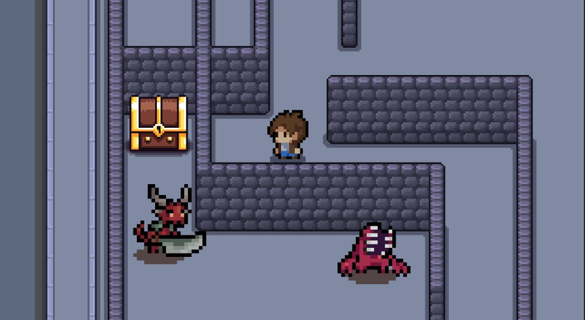
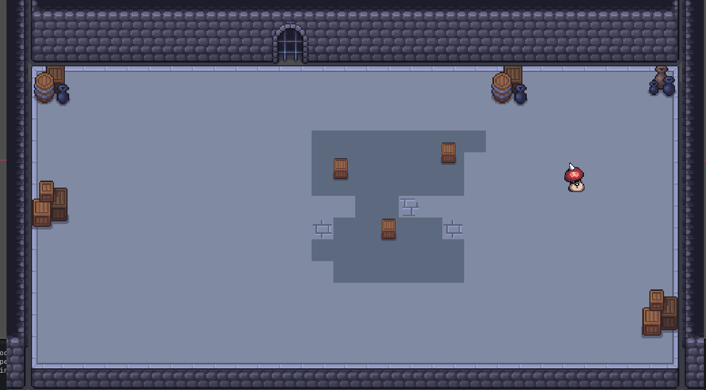
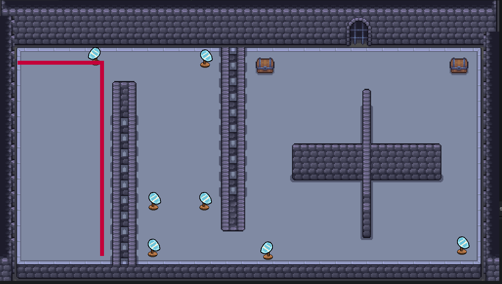

# Lost Inside ( A Lore-ful Dungeon )
## A game by [Hazoro](https://github.com/hazorox) - [AboEl5yr](https://github.com/AdhamMohamedKhairy) - [Vii](https://github.com/vii-abdullatif)
Live at [Itch.io](https://hazoro.itch.io/lost-inside)

# Plot
You, Alex (you don't choose how you're born...), are experiencing intense depression and anxiety.

That one day, you don't wake up from sleep. You hallucinate into a dungoen where you fight monsters, navigate through puzzles to reach your destination, The Tree of Life. 

The Tree of Life garauntess happiness and mental wellness...

# Controls
- Movement : WASD - Arrows
- Interaction : E - X
- Pause : Escape
- Attack : C - Space

# Building from Source
```sh
git clone https://github.com/hazorox/lost-inside.git
cd lost-inside/
```
Then open with Godot 4.7

# Guide
You firstly spawn into a really huge maze that leads into multiple other rooms and stuff, navigate your way to the tree of life !!

# Gallery




# IMPORTANT NOTE
- There is a bug with treasure spawning, if met, please refresh the website ( untill it's solved )
- escape menu had a bug and will be added further on

# AI - Declaration (Hazoro)
- Help with ray intersections logic whilst using it for the first time
- Guide on how to manage the laser reflection using Vector2
